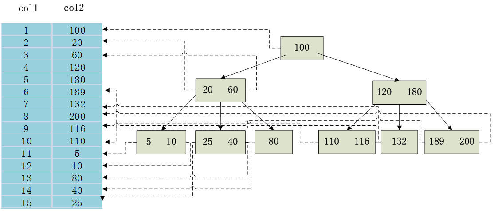

# 索引

## 索引的优点

- 大大加快数据的检索速度，这也是创建索引的最主要的原因；
- 加速表和表之间的连接；
- 在使用分组和排序子句进行数据检索时，同样可以显著减少查询中分组和排序的时间；
- 通过创建唯一性索引，可以保证数据库表中每一行数据的唯一性；

## 什么情况下设置了索引但无法使用？

- 以“%(表示任意0个或多个字符)”开头的LIKE语句，模糊匹配；
- OR语句前后没有同时使用索引；
- 数据类型出现隐式转化（如varchar不加单引号的话可能会自动转换为int型）；
- 对于多列索引，必须满足 最左匹配原则 (eg：多列索引col1、col2和col3，则 索引生效的情形包括 col1或col1，col2或col1，col2，col3)。

## 什么样的字段适合创建索引？

- 经常作查询选择的字段
- 经常作表连接的字段
- 经常出现在order by, group by, distinct 后面的字段

## 创建索引时需要注意什么？

非空字段：应该指定列为NOT NULL，除非你想存储NULL。在mysql中，含有空值的列很难进行查询优化，因为它们使得索引、索引的统计信息以及比较运算更加复杂。你应该用0、一个特殊的值或者一个空串代替空值；

取值离散大的字段：（变量各个取值之间的差异程度）的列放到联合索引的前面，可以通过count()函数查看字段的差异值，返回值越大说明字段的唯一值越多字段的离散程度高；

索引字段越小越好：数据库的数据存储以页为单位一页存储的数据越多一次IO操作获取的数据越大效率越高。

## 索引的缺点

时间方面：创建索引和维护索引要耗费时间，具体地，当对表中的数据进行增加、删除和修改的时候，索引也要动态的维护，这样就降低了数据的维护速度；

空间方面：索引需要占物理空间。

## 索引的分类

普通索引和唯一性索引：索引列的值的唯一性

单个索引和复合索引：索引列所包含的列数

聚簇索引与非聚簇索引：聚簇索引按照数据的物理存储进行划分的。对于一堆记录来说，使用聚集索引就是对这堆记录进行堆划分，即主要描述的是物理上的存储。正是因为这种划分方法，导致聚簇索引必须是唯一的。聚集索引可以帮助把很大的范围，迅速减小范围。但是查找该记录，就要从这个小范围中Scan了；而非聚集索引是把一个很大的范围，转换成一个小的地图，然后你需要在这个小地图中找你要寻找的信息的位置，最后通过这个位置，再去找你所需要的记录。

## 主键、自增主键、主键索引与唯一索引概念区别

主键：指字段 唯一、不为空值 的列；

主键索引：指的就是主键，主键是索引的一种，是唯一索引的特殊类型。创建主键的时候，数据库默认会为主键创建一个唯一索引；

自增主键：字段类型为数字、自增、并且是主键；

唯一索引：索引列的值必须唯一，但允许有空值。主键是唯一索引，这样说没错；但反过来说，唯一索引也是主键就错误了，因为唯一索引允许空值，主键不允许有空值，所以不能说唯一索引也是主键。

## 主键就是聚集索引吗？主键和索引有什么区别？

主键是一种特殊的唯一性索引，其可以是聚集索引，也可以是非聚集索引。

在SQLServer中，主键的创建必须依赖于索引，默认创建的是聚集索引，但也可以显式指定为非聚集索引。

InnoDB作为MySQL存储引擎时，默认按照主键进行聚集，如果没有定义主键，InnoDB会试着使用唯一的非空索引来代替。如果没有这种索引，InnoDB就会定义隐藏的主键然后在上面进行聚集。所以，对于聚集索引来说，你创建主键的时候，自动就创建了主键的聚集索引。

## 索引的底层实现原理和优化

索引是对数据库表中一个或多个列的值进行排序的数据结构，以协助快速查询、更新数据库表中数据。索引的实现通常使用B_TREE及其变种。索引加速了数据访问，因为存储引擎不会再去扫描整张表得到需要的数据；相反，它从根节点开始，根节点保存了子节点的指针，存储引擎会根据指针快速寻找数据。

　　上图显示了一种索引方式。左边是数据库中的数据表，有col1和col2两个字段，一共有15条记录；右边是以col2列为索引列的B_TREE索引，每个节点包含索引的键值和对应数据表地址的指针，这样就可以都过B_TREE在 O(logn) 的时间复杂度内获取相应的数据，这样明显地加快了检索的速度。

在数据结构中，我们最为常见的搜索结构就是二叉搜索树和AVL树(高度平衡的二叉搜索树，为了提高二叉搜索树的效率，减少树的平均搜索长度)了。然而，无论二叉搜索树还是AVL树，当数据量比较大时，都会由于树的深度过大而造成I/O读写过于频繁，进而导致查询效率低下，因此对于索引而言，多叉树结构成为不二选择。特别地，B-Tree的各种操作能使B树保持较低的高度，从而保证高效的查找效率。

### B-Tree(平衡多路查找树)

B_TREE是一种平衡多路查找树，是一种动态查找效率很高的树形结构。B_TREE中所有结点的孩子结点的最大值称为B_TREE的阶，B_TREE的阶通常用m表示，简称为m叉树。一般来说，应该是m>=3。一颗m阶的B_TREE或是一颗空树，或者是满足下列条件的m叉树：

1)树中每个结点最多有m个孩子结点；

2)若根结点不是叶子节点，则根结点至少有2个孩子结点；

3)除根结点外，其它结点至少有(m/2的上界)个孩子结点；

结点的结构如下图所示，其中，n为结点中关键字个数，(m/2的上界)-1 <= n <= m-1；di(1<=i<=n)为该结点的n个关键字值的第i个，且di< d(i+1)；ci(0<=i<=n)为该结点孩子结点的指针，且ci所指向的节点的关键字均大于或等于di且小于d(i+1)；

所有的叶结点都在同一层上，并且不带信息（可以看作是外部结点或查找失败的结点，实际上这些结点不存在，指向这些结点的指针为空）。

下图是一棵4阶B_TREE，4叉树结点的孩子结点的个数范围[2,4]。其中，有2个结点有4个孩子结点，有1个结点有3个孩子结点，有5个结点有2个孩子结点。

B_TREE的查找类似二叉排序树的查找，所不同的是B-树每个结点上是多关键码的有序表，在到达某个结点时，先在有序表中查找，若找到，则查找成功；否则，到按照对应的指针信息指向的子树中去查找，当到达叶子结点时，则说明树中没有对应的关键码。由于B_TREE的高检索效率，B-树主要应用在文件系统和数据库中，对于存储在硬盘上的大型数据库文件，可以极大程度减少访问硬盘次数，大幅度提高数据检索效率。

### B+Tree ： InnoDB存储引擎的索引实现

B+Tree是应文件系统所需而产生的一种B_TREE树的变形树。一棵m阶的B+树和m阶的B_TREE的差异在于以下三点：

- n棵子树的结点中含有n个关键码；

- 所有的叶子结点中包含了全部关键码的信息，及指向含有这些关键码记录的指针，且叶子结点本身依关键码的大小自小而大的顺序链接；

- 非终端结点可以看成是索引部分，结点中仅含有其子树根结点中最大（或最小）关键码。

下图为一棵3阶的B+树。通常在B+树上有两个头指针，一个指向根节点，另一个指向关键字最小的叶子节点。因此可以对B+树进行两种查找运算：一种是从最小关键字起顺序查找，另一种是从根节点开始，进行随机查找。

在B+树上进行随机查找、插入和删除的过程基本上与B-树类似。只是在查找时，若非终端结点上的关键码等于给定值，并不终止，而是继续向下直到叶子结点。因此，对于B+树，不管查找成功与否，每次查找都是走了一条从根到叶子结点的路径。

### 为什么说B+树比B树更适合实际应用中操作系统的文件索引和数据库索引？

B+tree的磁盘读写代价更低：B+tree的内部结点并没有指向关键字具体信息的指针(红色部分)，因此其内部结点相对B 树更小。如果把所有同一内部结点的关键字存放在同一盘块中，那么盘块所能容纳的关键字数量也越多。一次性读入内存中的需要查找的关键字也就越多，相对来说IO读写次数也就降低了；

B+tree的查询效率更加稳定：由于内部结点并不是最终指向文件内容的结点，而只是叶子结点中关键字的索引，所以，任何关键字的查找必须走一条从根结点到叶子结点的路。所有关键字查询的路径长度相同，导致每一个数据的查询效率相当；

数据库索引采用B+树而不是B树的主要原因：B+树只要遍历叶子节点就可以实现整棵树的遍历，而且在数据库中基于范围的查询是非常频繁的，而B树只能中序遍历所有节点，效率太低。

### 文件索引和数据库索引为什么使用B+树？

文件与数据库都是需要较大的存储，也就是说，它们都不可能全部存储在内存中，故需要存储到磁盘上。而所谓索引，则为了数据的快速定位与查找，那么索引的结构组织要尽量减少查找过程中磁盘I/O的存取次数，因此B+树相比B树更为合适。数据库系统巧妙利用了局部性原理与磁盘预读原理，将一个节点的大小设为等于一个页，这样每个节点只需要一次I/O就可以完全载入，而红黑树这种结构，高度明显要深的多，并且由于逻辑上很近的节点(父子)物理上可能很远，无法利用局部性。最重要的是，B+树还有一个最大的好处：方便扫库。B树必须用中序遍历的方法按序扫库，而B+树直接从叶子结点挨个扫一遍就完了，B+树支持range-query非常方便，而B树不支持，这是数据库选用B+树的最主要原因。